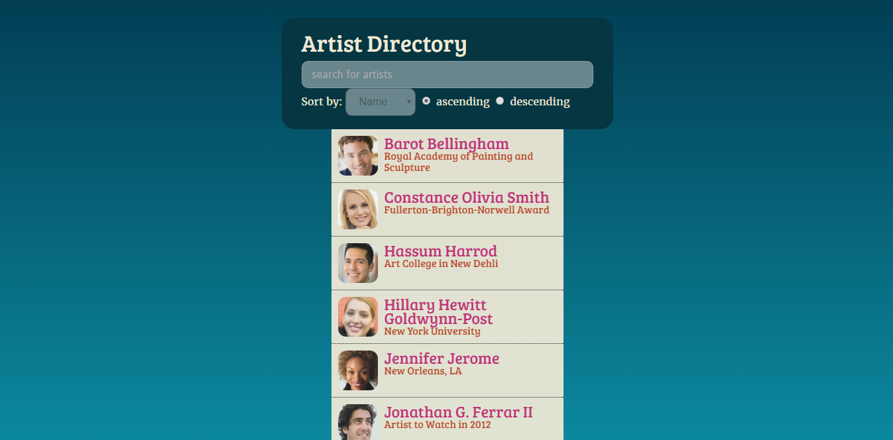
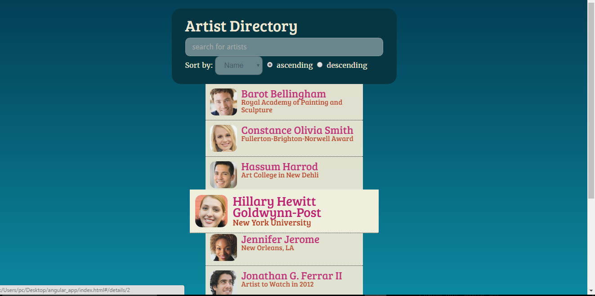
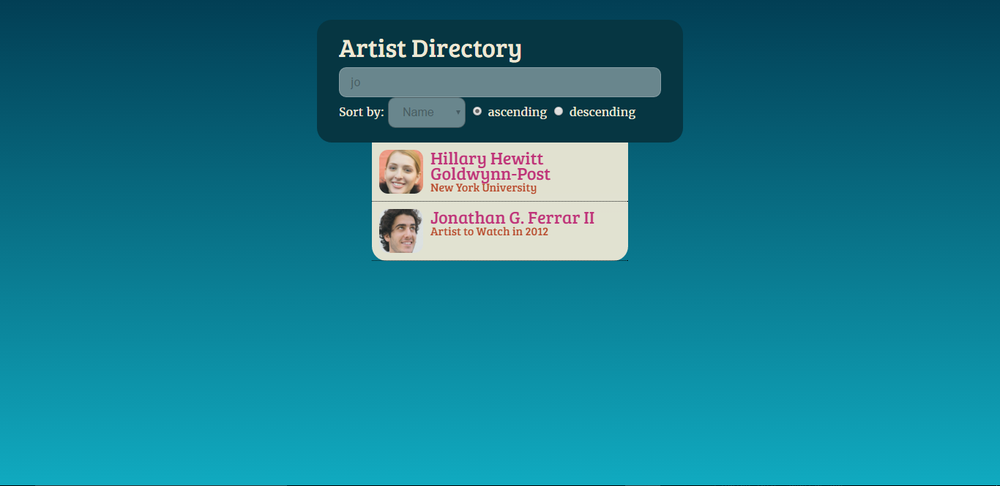
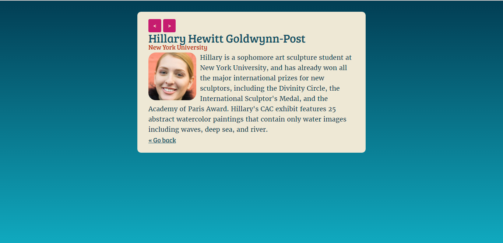

# Start AngularJS

## Description
This is a quick way to start learning Angular Js with this interesting app.You will learn 
1. To manage a proper directory structure of an angular app. 
2. Application of basics of Angular such as controllers,routing. 
3. To add dynamic styling using ng-animate.

##Snapshots
1.

2.

3.

4.

